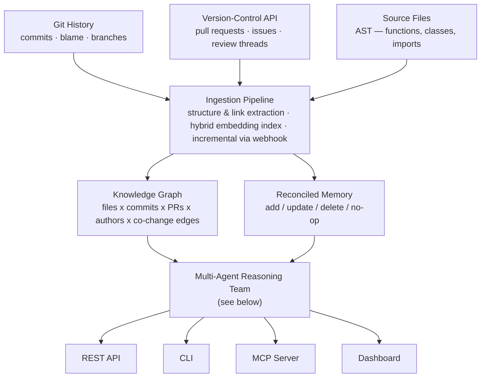
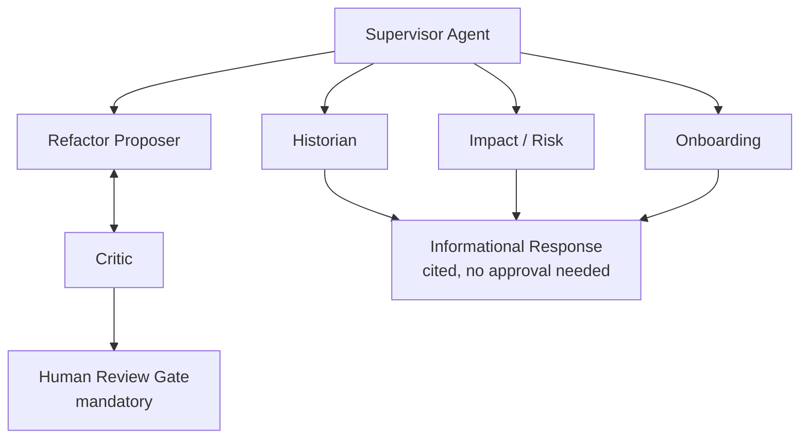

# Architecture

## Overview

Three source types feed a single ingestion layer, which populates two parallel stores — a knowledge graph and a reconciled memory store. Both feed a five-agent reasoning team behind a Supervisor router, which is served simultaneously through a REST API, a CLI, an MCP server, and a dashboard.

Ingestion runs once on first connection to a repository, then incrementally on every subsequent commit via a webhook, so the graph is never more than one push out of date. All source access is read-only.

## The agent team

Five agents operate under one supervising router. The three informational agents — Historian, Impact / Risk, and Onboarding — answer directly to the user; nothing about explaining code carries enough risk to require a human checkpoint. The Refactor path is different: a Proposer and a Critic argue before anything is shown, and even after they agree, a human approves the suggestion before it could become a real change.

**Historian** — traces a file or function back through its commit, pull-request, and issue history and explains why it looks the way it does, citing the specific commits and discussions involved.

**Impact / Risk** — given a proposed change, walks the co-change graph (files historically modified together) and the dependency graph to predict the likely blast radius.

**Refactor Proposer & Critic** — the Proposer drafts a concrete improvement grounded in traced history, not generic style advice. The Critic is a second, independently-prompted agent instructed to try to refute the suggestion. Only a proposal that survives this adversarial review reaches the human-approval gate.

**Onboarding** — generates a starting guide for a new contributor: the most central files by graph centrality, key architectural decisions traced from major pull requests, and a suggested reading order.

**Memory** — maintains a reconciled record of what has already been explained, and can mark a prior explanation as stale when a later commit invalidates it.

## Interfaces

All four interfaces sit in front of the same agent team — no interface has capabilities the others lack.

- **REST API** (FastAPI) — programmatic access; see `API.md`.
- **CLI** (Typer + Rich) — local, scriptable access for a single developer.
- **MCP server** (FastMCP) — exposes the same capabilities as tools other MCP-compatible clients can call directly; see `API.md`.
- **Dashboard** (Streamlit, Phase 3) — interactive graph visualization and query interface.

## Production readiness requirements

These apply from Phase 2 onward (see `ROADMAP.md`) and are not optional for a "production ready" claim:

- API-key authentication and rate limiting on every REST endpoint and every MCP tool.
- An audit log recording every query — timestamp, caller, tool, latency — persisted to SQLite (see `DATA_MODEL.md`).
- A health-check endpoint reporting graph freshness and the last-indexed commit.
- Continuous integration running lint and the full test suite on every push.
- A single-command containerized deployment (Docker Compose).
- No refactor or draft change-set reaches a user without passing Critic review and the human review gate — enforced in code, not just by convention.

## Non-negotiable safety property

No refactor suggestion ever ships without surviving Critic review **and** a mandatory human approval gate. This must hold at every phase, including Phase 1 — it is not deferred to "production hardening."
